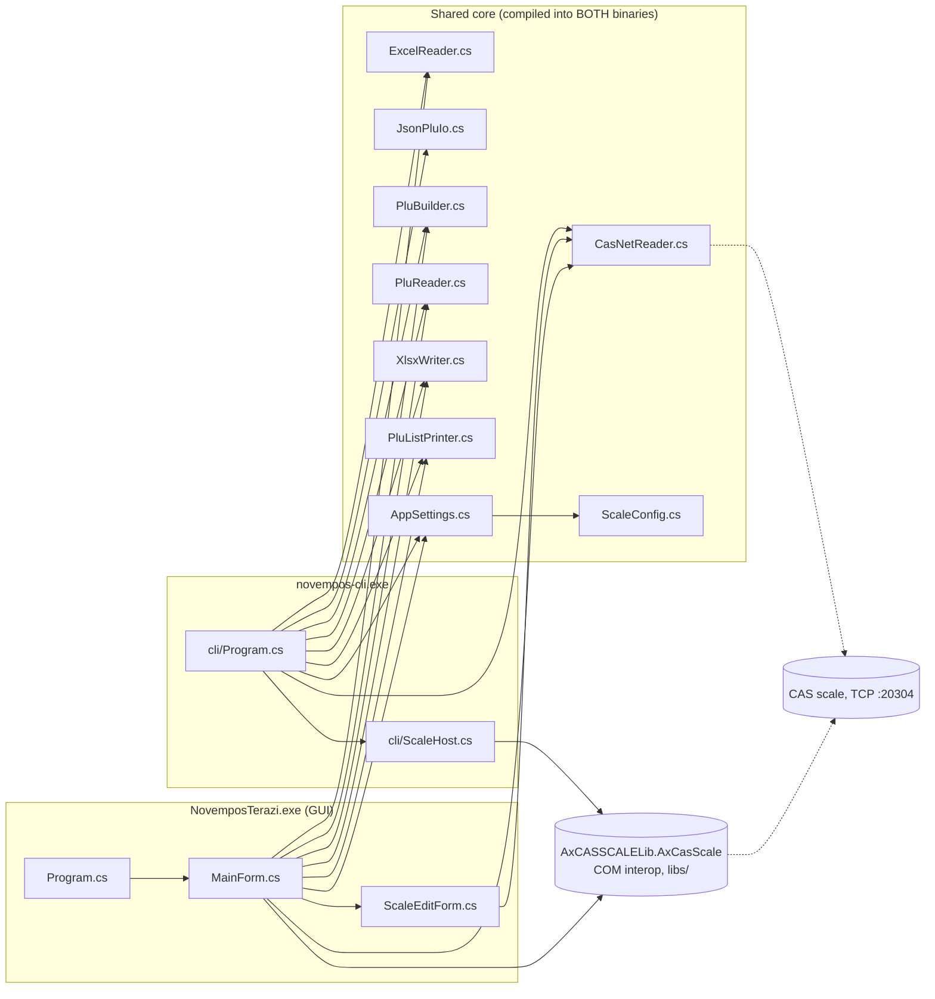

# Code references — NovemposCas

## Module dependency graph

`JsonPluIo.cs` is currently used only by the CLI, but it is compiled into the GUI too (shared core).

## Import relations (central files)

- **Row shape (`Dictionary<string,string>`, OrdinalIgnoreCase)** — the hub every module plugs into:
  - Producers: `ExcelReader.Read().Rows`, `JsonPluIo.Read`, `CasNetReader.Read`, `PluReader.Parse`.
  - Consumers: `PluBuilder.BuildV06` (send), `PluListPrinter` (print, via `"PLU No"`/`"Name"`), `XlsxWriter.Write` and `JsonPluIo.Write` (export, ordered by `PluReader.Columns`).
- **`MainForm.cs`** uses everything shared except `JsonPluIo`; owns the OCX instance and the send state machine (constants `ACTION_DOWNLOAD=3`, `RECV_SUCCESS=1001`, `RECV_FAIL=1002`).
- **`cli/Program.cs`** parses args, loads defaults from `AppSettings.Load()`, then delegates: send → `cli/ScaleHost.cs`, receive → `CasNetReader`, print → `PluListPrinter`.
- **`cli/ScaleHost.cs`** duplicates `MainForm`'s send state machine (same OCX constants) with `Application.DoEvents()` pumping instead of the WinForms event loop.
- **OCX interop:** `AxCASSCALELib` types come from `libs/AxInterop.CASSCALELib.dll` + `libs/Interop.CASSCALELib.dll`; the OCX itself and its native CAS DLLs load from beside the exe (copied from `runtime/`).

## Cross-cutting concerns

- **Logging:** no framework. GUI appends to a ListBox via `MainForm.Info()`; CLI writes to `Console`. Shared code takes an `Action<string>` log callback (`CasNetReader.Read`, `ScaleHost` ctor).
- **Error handling:** recoverable errors → message + early return / exit code; best-effort cleanup (disconnect, settings save) → empty `catch`. No exceptions cross module boundaries except file-parse errors, which callers catch.
- **Encoding:** PLU text is encoded with `windows-1254` (config key `encoding`, CLI `--encoding`). `PluBuilder.Txt` pads by byte count; `PluReader` assumes single-byte.
- **Config:** `AppSettings.cs` is the single settings store (also the CLI's defaults). `ScaleConfig` values travel per-scale.
- **Cancellation:** GUI sets flags (`sending`/`receiving`) polled by workers + a `cancelled` callback into `CasNetReader.Read`; CLI hooks Ctrl+C → `ScaleHost.RequestCancel()`.
- No auth, i18n framework, caching, or persistence beyond `ayarlar.txt`.

## If you change X, also check Y

| X (changed) | Y (must check) |
|---|---|
| `PluBuilder.BuildV06` field order/widths | `PluReader.Parse` (exact mirror), `PluReader.Columns`, sample `ornek_plu.xlsx`, Excel-format section of `OKUBENI.txt` |
| Column names in `PluReader.Columns` | Header lookups in `PluBuilder` / `MainForm.PrintPluList` / `cli/Program.cs`, JSON keys the Flutter POS produces/consumes |
| Send state machine in `MainForm.cs` | Same logic duplicated in `cli/ScaleHost.cs` (and vice versa) |
| `AppSettings` keys or file format | `OKUBENI.txt` settings section; legacy flat keys must keep mirroring `Scales[0]` (CLI defaults) |
| CLI flags / exit codes (`cli/Program.cs`) | Flutter POS invocations (external contract), help text in the same file, `OKUBENI.txt` CLI section |
| JSON schema (`JsonPluIo.cs`) | Flutter POS caller (external contract) |
| Adding/removing a shared root `.cs` file | `<Compile>` lists in BOTH `CasScaleSender.csproj` and `cli/NovemposCli.csproj` |
| Files in `runtime/` | `<Content>` items in `CasScaleSender.csproj`, `[Files]` in `installer/installer.iss` |
| Version | `Properties/AssemblyInfo.cs`, `cli/Program.cs` (`version` command string), `installer/installer.iss` (`AppVersion`) |
| Output exe names / project structure | `installer/installer.iss` (`AppExe`, `CliExe`, `SrcRel`, `CliSrc` defines) |
